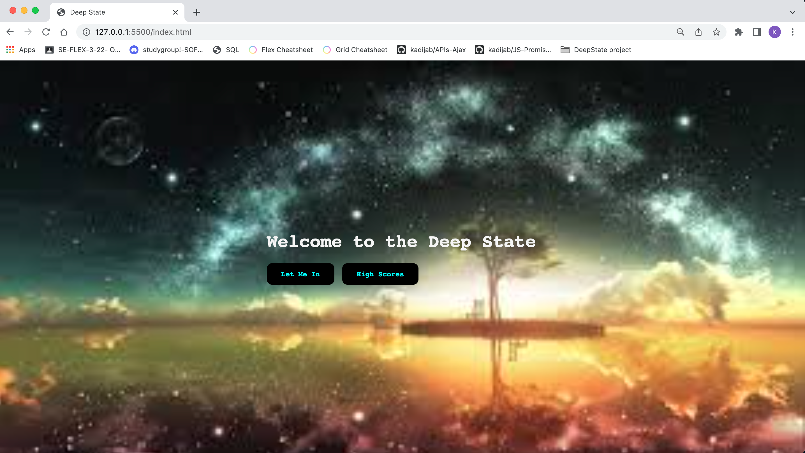
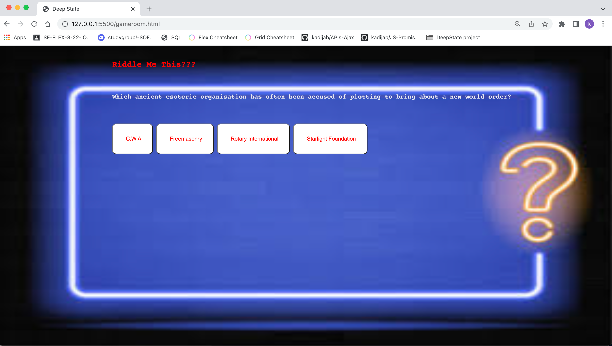
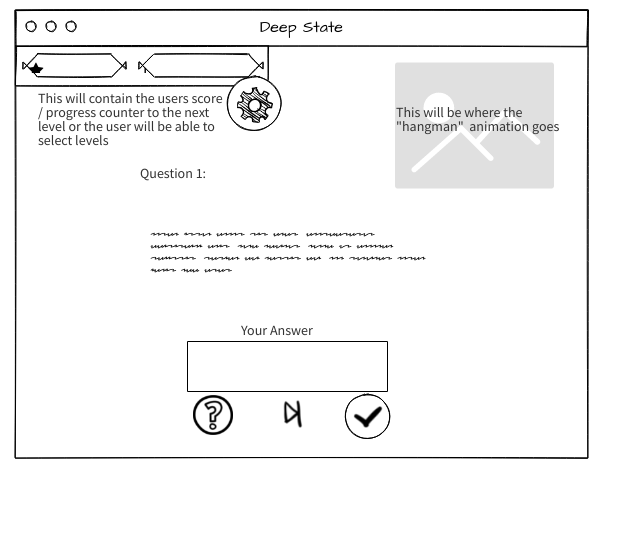

# Deep-State-

 
 #Application Layout
 
 
 #Technologies 
    The technologies used to create this project was Javascript,HTML and CSS.

 #Installation instructions
 
Navigate to web browser 
Go to https://github.com/KadijaBell/Deep-State-/ 
Enjoy game 

 #User stories 
"who are your users, what do they want and why?"
As a player I would like to read and answer questions
As a player I would like to select answer choices
As a player I would like to know which questions I have left
As a player I would like to view my progress selection
As a player I would like to know the score of my current game level
As a player I want a visual representation of my failed+}|
As a player I would like to have great images so that I can accurately guess answers

 #Wireframes  
 sketches of major views / interfaces in your application

.png)

 Descriptions of any Unsolved problems or major hurdles you had to overcome

I faced issues with :
-getting the answer choice to generate a new question
-getting the image to show as a pop out window
-getting the score to calculate 
-generating a you lose alert

Link to your hosted project in the URL section of your Github repo.
https://github.com/KadijaBell/Deep-State-/